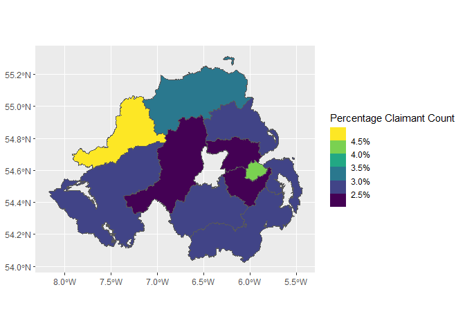

<!-- README.md is generated from README.Rmd. Please edit that file -->

# nisrarr

<!-- badges: start -->

[](https://github.com/MarkPaulin/nisrarr/actions/workflows/R-CMD-check.yaml)
[](https://app.codecov.io/gh/MarkPaulin/nisrarr)
[](https://CRAN.R-project.org/package=nisrarr)
<!-- badges: end -->

`nisrarr` is a package for accessing data from the [NISRA data
portal](https://data.nisra.gov.uk) directly from R.

## Installation

Install nisrarr from CRAN with:

``` r
install.packages("nisrarr")
```

Alternatively, you can install the development version of nisrarr from
[GitHub](https://github.com/) with:

``` r
# install.packages("pak")
pak::pak("MarkPaulin/nisrarr")
```

## Example

`nisra_search()` lets you search for a dataset using keywords or
variable names, and shows information like the last time the dataset was
updated:

``` r
library(nisrarr)
head(nisra_search(keyword = "claimant"))
#> # A tibble: 3 × 5
#>   dataset_code dataset_label    frequency dataset_dimensions updated            
#>   <chr>        <chr>            <chr>     <list>             <dttm>             
#> 1 CCMLGD       Claimant Count … Month     <chr [3]>          2025-06-10 10:18:23
#> 2 CCMAA        Claimant Count … Month     <chr [3]>          2025-06-10 10:17:45
#> 3 CCMSOA       Claimant Count … Month     <chr [3]>          2025-06-10 10:16:16
```

`nisra_read_dataset()` can be used to download a dataset from the NISRA
data portal as a data-frame:

``` r
claimant_count <- nisra_read_dataset("CCMLGD")
head(claimant_count)
#> # A tibble: 6 × 4
#>   Statistic      Month   `Local Government District`          value
#>   <chr>          <chr>   <chr>                                <dbl>
#> 1 Claimant Count 2005M01 Northern Ireland                     29573
#> 2 Claimant Count 2005M01 Antrim and Newtownabbey               1530
#> 3 Claimant Count 2005M01 Armagh City, Banbridge and Craigavon  2165
#> 4 Claimant Count 2005M01 Belfast                               7948
#> 5 Claimant Count 2005M01 Causeway Coast and Glens              2763
#> 6 Claimant Count 2005M01 Derry City and Strabane               4674
#> # Source: Claimant Count Monthly Data
```

The data portal also provides various types of metadata, which can be
accessed using `get_metadata()` or `get_metadata_field()`:

``` r
get_metadata(claimant_count)
#> Label: Claimant Count Monthly Data
#> Subject: Claimant Count
#> Type: Official statistics
#> Updated: 2025-06-10T10:18:23.357Z
#> Note: The claimant count is an administrative data source derived from Jobs and Benefits Offices ...
#> Contact: Economic and Labour Market Statistics
#> Contact email: economicstats@nisra.gov.uk
#> Contact phone: +44 (0)28 90529475
#> Copyright: Crown Copyright (https://www.nisra.gov.uk/crown-copyright)

get_metadata_field(claimant_count, "contact")
#> $name
#> [1] "Economic and Labour Market Statistics"
#> 
#> $email
#> [1] "economicstats@nisra.gov.uk"
#> 
#> $phone
#> [1] "+44 (0)28 90529475"
```

You can also access boundaries from the data portal. This isn’t
available for all datasets, so your mileage may vary:

``` r
library(dplyr)
#> Warning: package 'dplyr' was built under R version 4.4.1
#> 
#> Attaching package: 'dplyr'
#> The following objects are masked from 'package:stats':
#> 
#>     filter, lag
#> The following objects are masked from 'package:base':
#> 
#>     intersect, setdiff, setequal, union
library(ggplot2)
#> Warning: package 'ggplot2' was built under R version 4.4.3

claimant_count |> 
  nisra_get_boundaries() |> 
  filter(Statistic == "Percentage Claimant Count", Month == max(Month)) |> 
  ggplot(aes(fill = value)) +
  geom_sf() +
  scale_fill_binned(
    type = "viridis", 
    n.breaks = 6, 
    name = "Percentage Claimant Count",
    labels = scales::label_percent(scale = 1)
  )
```



## Help wanted / things that need done

There isn’t much error handling at the moment. If you’re using this
package and get an error message, please open an issue!

## Inspiration

This package is heavily based on
[csodata](https://github.com/CSOIreland/csodata), which wraps an
identical API. I also learnt a lot from reading the code for
[nomisr](https://github.com/ropensci/nomisr).
